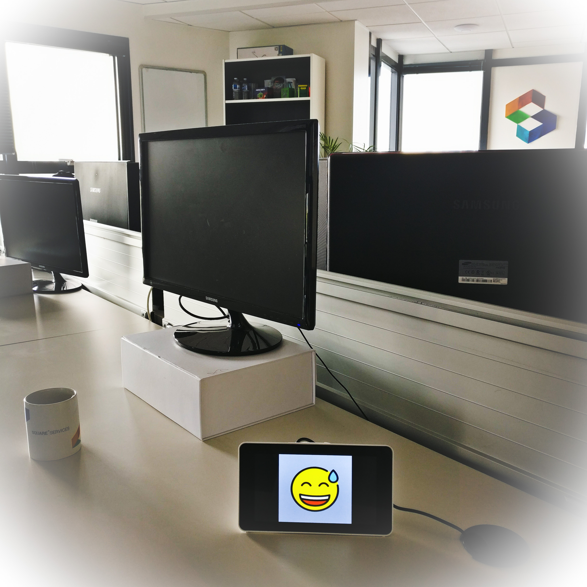

# Flogo demo by Square IT Services - IoT application



## Introduction

This repository is part of the [**Flogo Demo by Square IT Services**](https://github.com/square-it/flogo-demo).

* [This Flogo application](#description) manages the screen display part.
* [Another Flogo application](https://github.com/square-it/flogo-demo-services) is used to manage the interactions with end-users.

Currently, these two applications communicates very simply through a REST service.


## Description

The application is running on a Raspberry Pi.
Its goal is to display a smiley image on the display of the Raspberry Pi.

The smiley image is chosen using a **REST API over HTTP**.
This API is described by the file [swagger.yaml](swagger.yaml)

## Implementation

The application is built with [Flogo](http://www.flogo.io/) and [Square IT custom activities](https://github.com/square-it/flogo-contrib-activities).

The flow is composed of:

- A REST trigger
- A log activity to print the input request
- A command activity to hide the previous smiley image displayed
- A command activity to display the new smiley image
- A return activity to reply to the client

The program [fbi](https://linux.die.net/man/1/fbi) is used by the application to display the images.

The smiley images used come from the [openmoji site](http://openmoji.org/).

## Prerequisites

* a Raspberry Pi with a screen display, sudoer right and SSH access (using Raspbian with default user ```pi``` is advised)
* a system with Go & Flogo installed (for compilation only)

## Usage

### Preparation

1. configure your SSH config (considering the Raspberry Pi is reachable at 192.168.1.2)
```
mkdir -p ~/.ssh
touch ~/.ssh/config
export RPI_IP=192.168.1.2
cat <<EOF >> ~/.ssh/config
Host rpi
        HostName $RPI_IP
        User pi
EOF
```

2. copy the smileys to the Raspberry Pi
```
ssh rpi 'curl -fsSL https://github.com/hfg-gmuend/openmoji/releases/download/1.0.0/618x618-color.zip > /tmp/618x618-color.zip && rm -rf ~/emojis && unzip -q /tmp/618x618-color.zip -d ~/emojis'
```

3. install ```fbi```
```
ssh rpi 'sudo apt-get update && sudo apt-get install -y fbi'
```

### Build from sources

1. clone this repository
```
git clone https://github.com/square-it/flogo-demo-iot.git
cd flogo-demo-iot
```

2. compile the application into a native executable
```
GOOS=linux GOARCH=arm GOARM=7 flogo build -e
```

3. copy the executable to the Raspberry Pi
```
scp bin/linux_arm/flogo-demo-iot rpi:~
```

4. run the executable on the Raspberry Pi
```
ssh rpi 'sudo DEMO_IOT_EMOJIS_DIR=~/emojis/618x618-color ~/flogo-demo-iot'
```

5. test with a sample smiley
```
curl http://192.168.1.2:4445/v1/smiley/1F605
```
